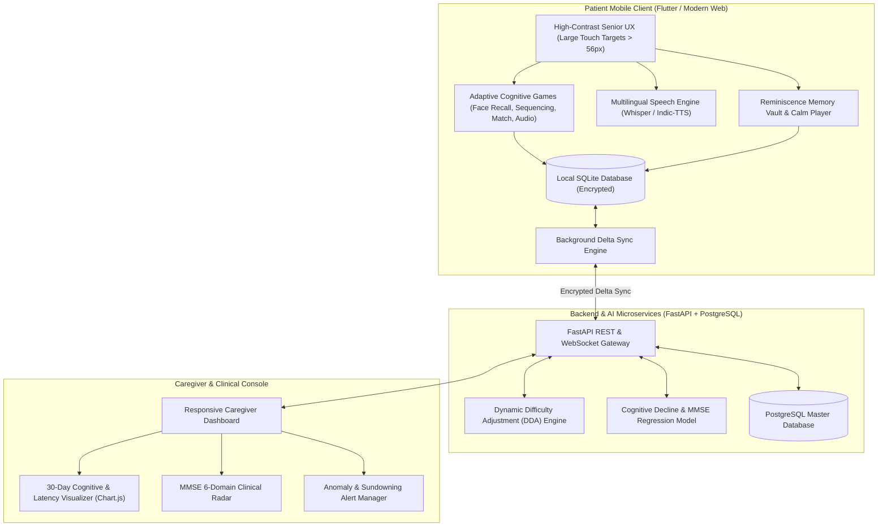

# Smart India Hackathon (SIH) — Comprehensive Project Report

## Project Title
**Smriti Sahayak (স্মৃতি সহায়ক): AI-Powered Cognitive Gaming, Reminiscence Memory Assistance, and Clinical Monitoring Platform for Dementia Patients in Low-Connectivity Regions**

---

## 1. Executive Summary
Dementia, Alzheimer's disease, and related progressive cognitive disorders present an escalating public health crisis across India, notably in the **North Eastern Region (NER)**. The geography, cultural diversity, and infrastructural realities of the North East—characterized by hilly terrain, isolated rural hamlets, intermittent internet connectivity, and multi-dialectal linguistic landscapes (Assamese, Bengali, Manipuri, Bodo, Hindi, Khasi, Mizo, etc.)—severely exacerbate healthcare accessibility barriers.

**Smriti Sahayak** is an end-to-end digital health ecosystem engineered to overcome these exact regional constraints. It provides:
1. **Offline-First Cognitive Therapy**: Multimodal adaptive brain exercises that run 100% locally on low-cost Android tablets/smartphones without requiring continuous internet.
2. **Culturally Anchored Reminiscence**: A personalized "Memory Vault" utilizing family photographs, voice messages in native dialects, and regional sensory anchors (e.g., Bihu flute melodies, temple chimes) to reduce anxiety, sundowning agitation, and disorientation.
3. **Dynamic Difficulty Adjustment (DDA)**: An adaptive machine learning algorithm that modulates game speed, visual clues, and hint thresholds in real time to prevent patient frustration while sustaining cognitive neuroplasticity.
4. **Multilingual Voice Interaction**: Conversational voice companion supporting regional North-Eastern languages, enabling illiterate or motor-impaired elders to check schedules, listen to calming messages, and log daily routines effortlessly.
5. **Caregiver & Clinical Telemetry**: Remote clinical dashboard tracking longitudinal cognitive decline trends, Mini-Mental State Examination (MMSE) domain alignments, medication adherence rates, and acute confusion anomaly alerts.

---

## 2. Problem Analysis & North Eastern Regional Context

### 2.1 The Growing Burden of Dementia in NER
According to the Longitudinal Ageing Study in India (LASI) and the Dementia India Report:
- Over 8.8 million Indians aged 60+ live with dementia, projected to exceed 14 million by 2036.
- In North Eastern states (Assam, Meghalaya, Manipur, Nagaland, Tripura, Mizoram, Arunachal Pradesh, Sikkim), geriatric healthcare and dedicated memory clinics are overwhelmingly concentrated in major urban centers (e.g., Guwahati, Imphal, Shillong).
- Rural elders face a critical shortage of specialized neuropsychologists and occupational therapists.

### 2.2 Core Operational Challenges
| Challenge | Real-World Clinical Impact | Smriti Sahayak Solution |
| :--- | :--- | :--- |
| **Intermittent Connectivity** | Cloud-only apps crash or fail to load reminders in remote hills. | **Offline-First SQLite Engine** with delta synchronization when connectivity resumes. |
| **Linguistic & Cultural Alienation** | Standard Western/English memory apps fail to resonate with regional elders. | **Multilingual Voice & Culturally Anchored Motifs** (Assamese, Bengali, Manipuri, Hindi). |
| **Patient Frustration / Drop-out** | Rigid game difficulty causes distress or apathy in dementia patients. | **Real-Time DDA Engine** that dynamically assists when hesitation or error is detected. |
| **Sundowning & Evening Agitation** | Heightened anxiety and confusion during sunset hours burden caregivers. | **"Calm Me Down" Grounding Mode** combining guided 4-7-8 breathing and loved ones' voice notes. |
| **Medication Non-Compliance** | Missed cholinergic/vascular medications accelerate cognitive decline. | **Voice-Spoken Pill Alerts** with escalation notifications to remote caregivers. |

---

## 3. System Architecture & Technical Specifications

---

## 4. Mathematical Formulation: Dynamic Difficulty Adjustment (DDA)

To sustain patient engagement and prevent the cognitive fatigue/frustration loop common in dementia, the system evaluates each interaction through an **Exponential Moving Average (EMA)** latency and error recovery model:

$$\text{Performance Score } (P) = w_1 \cdot A + w_2 \cdot S + w_3 \cdot (1 - H)$$

Where:
- $A \in [0, 1]$ is the Accuracy Rate over the last $N=5$ trials.
- $S = \max\left(0, \min\left(1, \frac{T_{\text{max}} - L_{\text{avg}}}{T_{\text{max}} - T_{\text{min}}}\right)\right)$ is the Normalized Reaction Speed ($T_{\text{max}} = 5000\text{ms}, T_{\text{min}} = 1000\text{ms}$).
- $H = \min\left(1, \frac{\text{Hints Used}}{3}\right)$ is the Hint Penalty Index.
- Weights: $w_1 = 0.50, w_2 = 0.35, w_3 = 0.15$.

### Difficulty Tier Transitions
- **If $P \ge 0.78$**: Escalate to **Tier 3 (Active Challenge)** — shorter timeout ($16\text{s}$), $4$ choices, zero automatic visual anchors.
- **If $0.45 \le P < 0.78$**: Maintain **Tier 2 (Moderate Balanced)** — $25\text{s}$ window, $4$ choices, voice hint after $8\text{s}$.
- **If $P < 0.45$**: De-escalate to **Tier 1 (Gentle Support)** — $40\text{s}$ window, $2$ large visual choices, automatic audio guidance after $4\text{s}$.

---

## 5. Clinical Telemetry & MMSE Domain Alignment

The platform maps patient in-game performance directly to the 6 core clinical sub-domains of the **Mini-Mental State Examination (MMSE)**:

1. **Temporal & Spatial Orientation (20% Weight)**: Assessed via daily voice check-ins and calendar grounding interactions.
2. **Immediate Registration (20% Weight)**: Evaluated through face-to-name association and immediate photo recall.
3. **Attention & Calculation (20% Weight)**: Evaluated via chronologic daily sequencing and audio-rhythm recognition.
4. **Delayed Recall (25% Weight)**: Evaluated by querying photo recognition after a 15-minute inter-game delay.
5. **Language & Naming (10% Weight)**: Evaluated through regional object naming (e.g., Japi, Gamosa, Tea Cup).
6. **Visual-Spatial Praxis (5% Weight)**: Evaluated through cultural tile spatial pair matching.

### Longitudinal Cognitive Baseline Index ($CBI$)

$$CBI = 0.55 \cdot \bar{G} + 0.30 \cdot \left(100 - \frac{\bar{L} - 800}{25}\right) + 0.15 \cdot (M \cdot 100)$$

Where $\bar{G}$ is the Mean Game Score, $\bar{L}$ is the Mean Reaction Latency (ms), and $M$ is the Medication Compliance Rate ($\in [0, 1]$).

---

## 6. Social Impact, Feasibility, & Innovation Highlights

### 6.1 Key Innovations
1. **Dignity-Centered Reminiscence Therapy**: Unlike sterile medical testing software, Smriti Sahayak uses the elder's actual family photos and grandchildren's voice notes, transforming therapy into an emotionally uplifting experience.
2. **Zero-Failure UI**: Games do not display punishing "Game Over" or harsh red error buzzers. Wrong choices produce gentle audio redirection ("Let us remember together: Priya calls you every morning").
3. **Bandwidth-Agnostic Synchronization**: All daily games and emergency voice prompts function fully in remote tribal villages without mobile data, uploading encrypted delta logs whenever connectivity is available.
4. **Caregiver Peace of Mind**: Remote working family members in Delhi or Bangalore can monitor their elderly parents in Assam/Manipur in real time.

---

## 7. Conclusion
Smriti Sahayak bridges the critical gap between specialized geriatric cognitive therapy and rural healthcare realities in North-East India. By combining culturally tailored content, offline-first engineering, and clinical telemetry, it delivers an accessible, affordable, and compassionate standard of care for dementia patients and their caregivers.
